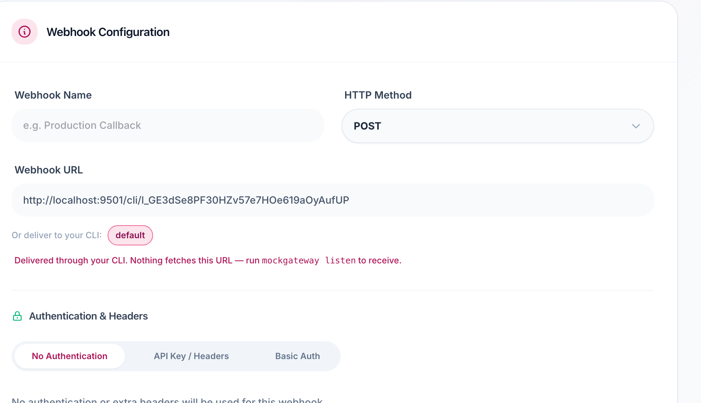

# mockgateway-cli

Receive payment webhooks on `localhost` — no tunnel, and the URL doesn't
change every time you restart.

[MockGateway](https://mockgateway.com) is a payment gateway simulator: you
build and test payment integrations against a fake Stripe, PayPal, Braintree,
or whatever gateway you're targeting, without touching a real payment
provider. This CLI is how its webhooks reach your machine while you develop.

```bash
npm install -g mockgateway-cli
mockgateway login --token '<token>'
mockgateway listen --forward-to http://localhost:3000/webhook
```

```
✓ Connected to MockGateway
✓ Forwarding to http://localhost:3000/webhook

  Webhook URL (paste into your gateway settings):
  https://mockgateway.com/cli/l_7fK2pQ9xR4mN8wZ

14:22:07  payment.success   → 200 OK     42ms
14:22:19  payment.failed    → 200 OK     31ms
14:22:31  refund.completed  ✗ connection refused — is your app running on :3000?
```

## Where the URL goes

Paste the printed URL into your gateway's webhook field in the MockGateway
dashboard, under **Webhooks → Configurations**:



Do this once. It keeps working after you restart the CLI, reboot your
machine, or come back next week.

## Why not just use a tunnel

| | ngrok / a tunnel | mockgateway-cli |
| --- | --- | --- |
| Separate account | yes | no |
| URL changes | every restart | never |
| Update webhook settings | every time | once |
| Machine reachable from the internet | yes | no |
| Delivery log | separate dashboard | in your terminal |

Your machine opens the connection outward, so nothing has to reach it from
outside. The URL stays the same because it's tied to your account, not to a
socket that happened to get one this time.

## How it works

MockGateway can't reach your machine directly — it's behind NAT, a firewall,
or it's just not always on. So the CLI opens the connection the other way: it
connects out to MockGateway and holds the line open. When a webhook fires,
MockGateway pushes it down that line, and the CLI makes the actual HTTP
request to your `--forward-to` URL from inside your own network.

The request itself isn't reshaped for this — same method, headers, signature,
and body your gateway is configured to send. Your verification code is
tested against the real thing.

## Commands

| Command | What it does |
| --- | --- |
| `login --token <token>` | Store your token in `~/.mockgateway/config.json` |
| `listen --forward-to <url> [--label <name>]` | Hold a connection open and forward webhooks to `<url>` |
| `trigger [--gateway <slug>] [--scenario <name>] [--label <name>]` | Send one webhook now, without running a payment |
| `logs [--limit <n>]` | What was delivered recently |

`--label` names the listener. Leave it out and you get one called `default`.
Run more than one at a time to keep separate projects apart:

```bash
mockgateway listen --forward-to http://localhost:3000/hook --label shop
mockgateway listen --forward-to http://localhost:8000/webhook --label billing
```

Each label keeps its own URL, so `trigger --label billing` and `logs
--label billing` know which one you mean.

## Requirements

Node 18 or newer. No dependencies.

## Links

- [MockGateway](https://mockgateway.com)
- [Issues](https://github.com/mockgateway/mockgateway-cli/issues)

## License

MIT
